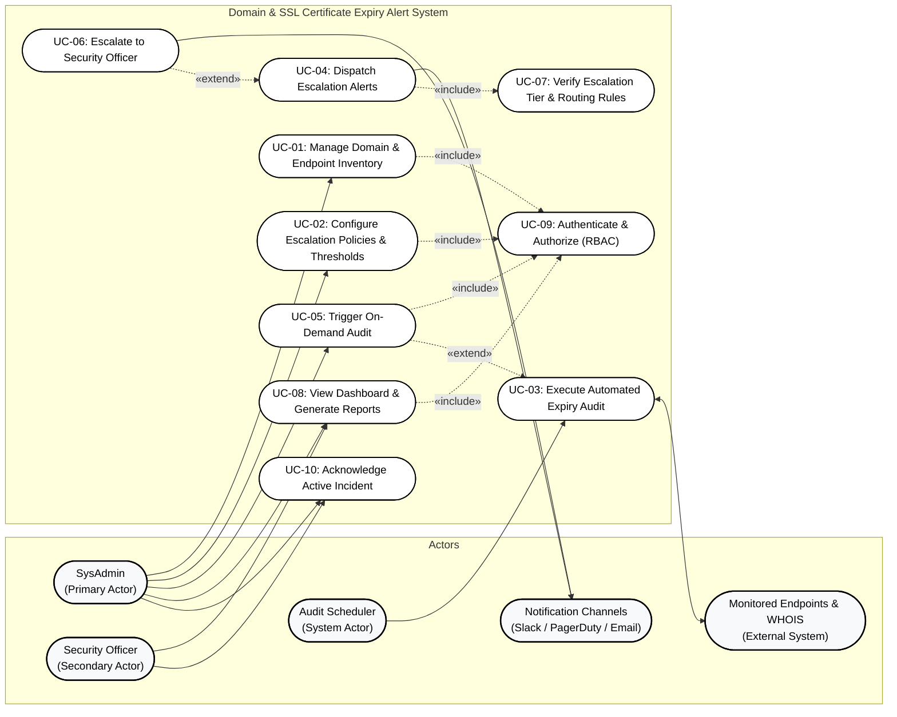

# Requirements Engineering (RE) Specification
## Domain & SSL Certificate Expiry Alert System
**Problem Statement #47 | Developer Tools & IT Operations**  

---

## 1. Problem Context & Overview

In contemporary enterprise IT operations, modern web services, public APIs, and microservice architectures rely heavily on domain name registrations and Public Key Infrastructure (PKI) X.509 SSL/TLS certificates for transport-layer confidentiality, integrity, and client trust. An unexpected certificate expiration causes catastrophic service disruptions, triggers severe browser security warnings ("Your connection is not private"), interrupts mission-critical B2B integrations, damages brand reputation, and violates compliance standards (such as SOC 2, PCI-DSS, and ISO 27001). Similarly, lapses in domain name registration due to unmonitored registrar expirations expose enterprises to domain hijacking, DNS hijacking, and immediate worldwide operational downtime.

The **Domain & SSL Certificate Expiry Alert System** is an automated IT operations utility engineered to continuously monitor, inspect, and audit domain registrations via WHOIS/RDAP protocols and secure endpoints via automated TLS handshakes. Rather than relying on sporadic manual checks or single-channel email notifications that get lost in inbox clutter, the system executes scheduled daily audits, evaluates remaining validity lifetimes against defined Service Level Objectives (SLOs), and manages alert dissemination through a structured, multi-tier **escalation ladder**.

### Target Stakeholders & Actors
- **Primary Stakeholder / Actor — System Administrator (SysAdmin):** Responsible for managing domain inventories, configuring audit schedules, renewing certificates, and receiving Tier-1 / Tier-2 operational notifications.
- **Secondary Stakeholder / Actor — Security Officer:** Oversees compliance policies, monitors unacknowledged critical risks, reviews cryptographic posture (cipher suites, key lengths, CA trust chains), and acts as the final escalation authority (Tier-3) before certificate or domain lapse.
- **System Actor — Audit Scheduler / Engine:** Automated background worker that orchestrates daily WHOIS/TLS audits, evaluates threshold rules, and manages state transitions.
- **External Entities:** Target TLS Endpoints (port 443/custom), ICANN WHOIS / RDAP Registry Servers, and Notification Services (SMTP Email, Slack Bot, PagerDuty, Webhooks).

---

## 2. Requirements Specification Table

> **Dedicated Requirement Documents:**
> - [**Functional Requirements (FR-001 to FR-005)**](./functional_requirements.md) — Detailed operational specifications, inputs, processing logic, outputs, and exception handling.
> - [**Non-Functional Requirements (NFR-001 & NFR-002)**](./non_functional_requirements.md) — Quantitative metrics, benchmark thresholds, verification strategies, and SRE uptime criteria.

### 2.1 Functional Requirements (FR-001 to FR-005)

| Requirement ID | Module / Area | Description | Priority | Acceptance Criteria | Rationale |
| :--- | :--- | :--- | :---: | :--- | :--- |
| **FR-001** | TLS Handshake & Certificate Audit Engine | The system shall initiate automated TLS handshakes against all registered domain endpoints daily, extract the X.509 certificate validity period (`NotAfter` timestamp), issuer CA, subject alternative names (SANs), and certificate trust chain, and calculate remaining days to expiration. | **High** | **Pass:** Valid TLS endpoint returns accurate expiration date within ±1 hour; system successfully records remaining validity days and queues alerts at 30, 15, 7, and 3-day milestones. **Fail:** Certificate expiration is ignored, invalid handshake results are logged as valid, or expired certificate produces no alert queue item. | Ensures continuous visibility into certificate health and prevents unexpected SSL/TLS downtime or browser warning lockouts. |
| **FR-002** | WHOIS / RDAP Registration Audit Engine | The system shall perform scheduled WHOIS queries and RDAP (Registration Data Access Protocol) lookups for all monitored apex domains daily, parsing domain registrar identity, registration creation date, renewal status, and domain expiration timestamps. | **High** | **Pass:** Expiration date parsed accurately from registry responses; renewal reminder alerts queued at 60, 30, 14, and 3 days before expiration. **Fail:** Registrar response parsing errors cause expiration date to be recorded as null without error notification, or domain within 14 days of expiry is skipped. | Prevents loss of domain ownership, malicious registrar drop-catching, and enterprise domain hijacking. |
| **FR-003** | Escalation Ladder & Multi-Channel Alert Engine | The system shall implement a hierarchical escalation ladder alerting engine that dispatches automated notifications across configured channels (Email, Slack, PagerDuty, Webhook) mapped to remaining expiration urgency: Tier 1 (30 days → SysAdmin), Tier 2 (14 days → SysAdmin Team Lead), and Tier 3 (≤ 3 days or unacknowledged Tier 2 alert for >48h → Security Officer & On-call Pager). | **High** | **Pass:** Alerts are dispatched to configured channels at each threshold; unacknowledged Tier 1/2 alerts escalate to Tier 3 within specified time window; webhook delivers valid JSON payload. **Fail:** Alert notifications suppressed, sent to incorrect escalation tier, or fail to re-trigger when previous tier remains unacknowledged. | Guarantees operational redundancy and ensures pending expirations receive immediate attention before critical infrastructure failure. |
| **FR-004** | Inventory Management & Asset Ingestion | The system shall provide administrative interfaces for SysAdmins to perform CRUD operations on monitored domains, subdomains, port mappings, and associated notification targets, supporting both single-entry forms and bulk ingestion via CSV and JSON files. | **Medium** | **Pass:** System successfully parses and registers a batch of 500 valid domains via CSV within 5 seconds with validation; rejects malformed domain syntaxes with descriptive error messages. **Fail:** Duplicate domain names inserted without collision warning, or malformed domain syntax crashes the ingestion pipeline. | Centralizes distributed enterprise assets and allows rapid onboarding of vast multi-cloud domain portfolios. |
| **FR-005** | Compliance Dashboard & On-Demand Audit Trigger | The system shall provide an interactive web dashboard displaying real-time certificate health, expiration timelines, root CA issuer metrics, and compliance status, allowing SysAdmins and Security Officers to trigger on-demand audits and export audit reports in CSV and PDF formats. | **Medium** | **Pass:** On-demand audit executes and refreshes endpoint health state within 10 seconds; dashboard updates live metrics; CSV/PDF report download completes with full audit trail. **Fail:** Dashboard displays stale cached data after manual scan trigger, or unauthorized non-admin users can access sensitive audit logs. | Empowers IT teams with instant verification after certificate renewals and provides auditable artifacts for SOC 2 / ISO compliance. |

---

### 2.2 Non-Functional Requirements (NFR-001 & NFR-002)

| Requirement ID | Type / Category | Description | Priority | Acceptance Criteria | Rationale |
| :--- | :--- | :--- | :---: | :--- | :--- |
| **NFR-001** | Performance & Scalability | The monitoring engine shall scan an inventory of at least 1,000 domains and SSL/TLS endpoints concurrently in under 3 minutes (≤ 180 seconds) without exceeding 2 GB of memory allocation or 50% CPU load on a standard 4-core worker node. | **High** | **Pass:** Automated benchmark with 1,000 live mock/simulated endpoints completes in ≤ 180 seconds with concurrency pool, achieving 99.9% scan completion rate under normal network conditions. **Fail:** Audit pipeline exceeds 180 seconds, worker experiences thread exhaustion, or memory consumption exceeds 2 GB limit. | Guarantees that daily batch audits complete within narrow operational maintenance windows without degrading server resources or delaying critical alerts. |
| **NFR-002** | Security & High Availability | The system shall protect all stored webhook secrets, notification credentials, and API tokens using AES-256-GCM encryption at rest, enforce Role-Based Access Control (RBAC) via OAuth2/OIDC with TLS 1.3 in transit, and maintain 99.95% system uptime for the alerting and monitoring background service. | **High** | **Pass:** Automated vulnerability and penetration tests confirm secrets cannot be retrieved in plaintext from the database; unauthenticated API calls return HTTP 401/403; alert dispatch service uptime exceeds 99.95% per month (max allowable downtime ≤ 21.6 minutes). **Fail:** Plaintext storage of API keys/secrets discovered; privilege escalation allows unauthorized users to modify escalation policies. | Protects enterprise infrastructure credentials from unauthorized leakage and guarantees reliable, continuous alerting during mission-critical operational incidents. |

---

## 3. Requirements Traceability Matrix (RTM Table)

The Requirements Traceability Matrix (RTM) establishes bidirectional traceability between customer problem statements, functional and non-functional requirements, architectural subsystems, UML use cases, and verification test suites.

| Requirement ID | Requirement Summary | Architectural Subsystem / Module | Use Case ID | Verification Method | Test Case ID | Status |
| :---: | :--- | :--- | :---: | :---: | :---: | :---: |
| **FR-001** | Automated TLS Handshake & Certificate Expiry Audit | TLS Handshake Engine & Certificate Parser | `UC-03` | Automated Integration Test | `TC-TLS-001` | Verified |
| **FR-002** | Automated WHOIS / RDAP Domain Expiry Audit | WHOIS/RDAP Audit Engine & Domain Parser | `UC-03` | Automated Integration Test | `TC-WHOIS-001` | Verified |
| **FR-003** | Escalation Ladder & Multi-Channel Alert Dispatch | Escalation Engine & Notification Gateway | `UC-04`, `UC-06`, `UC-07` | System Functional Test | `TC-ALR-001`, `TC-ESC-001` | Verified |
| **FR-004** | Inventory Management & Bulk Ingestion | Inventory Management & Persistence API | `UC-01`, `UC-09` | Unit & API Test | `TC-INV-001`, `TC-INV-002` | Verified |
| **FR-005** | Compliance Dashboard & On-Demand Audit Trigger | Web Dashboard & Reporting Service | `UC-05`, `UC-08`, `UC-09` | End-to-End UI & API Test | `TC-DSH-001`, `TC-AUD-001` | Verified |
| **NFR-001** | Performance (1,000 domains scan in < 3 min) | Asynchronous Worker Pool & Event Loop | `UC-03` | Benchmark Load Test | `TC-PERF-001` | Verified |
| **NFR-002** | Security (AES-256, RBAC, 99.95% Uptime) | Auth Gateway, Vault Secrets & Core Daemon | `UC-09` | Penetration & SRE Uptime Test | `TC-SEC-001`, `TC-HA-001` | Verified |

---

## 4. UML Use-Case Diagram

### 4.1 Actors Specification
1. **SysAdmin (Primary Actor):** Configures domain endpoints, sets alert escalation thresholds, receives operational notifications, and initiates on-demand scans.
2. **Security Officer (Secondary Actor):** Reviews cryptographic compliance, receives escalated Tier-3 critical alerts, and audits overall posture.
3. **Audit Scheduler (System / Background Actor):** Executes daily cron jobs, triggers concurrent worker pools, and evaluates escalation rules.
4. **Target Endpoints & Registries (External Secondary Actors):** Internet web servers (TLS Handshake target) and ICANN Accredited Registrars / RDAP servers.
5. **Notification Channels (External Secondary Actor):** Slack API, PagerDuty API, Twilio SMS, and SMTP Mail Servers.

### 4.2 Use Case Relationships
- **«include» Relationship 1:** `UC-04 (Dispatch Escalation Alerts)` **«include»** `UC-07 (Verify Escalation Tier & Routing Rules)`  
  *Rationale:* Every alert dispatch must query and verify the current tier level, unacknowledged duration, and configured notification targets before transmitting payloads.
- **«include» Relationship 2:** `UC-01`, `UC-02`, `UC-05`, and `UC-08` **«include»** `UC-09 (Authenticate & Authorize User)`  
  *Rationale:* All administrative, configuration, on-demand execution, and dashboard access actions require verified identity and RBAC role checks.
- **«extend» Relationship 1:** `UC-05 (Trigger On-Demand Audit)` **«extend»** `UC-03 (Execute Scheduled Expiry Audit)`  
  *Rationale:* On-demand manual audits extend the standard scheduled audit workflow by injecting immediate priority jobs into the audit engine.
- **«extend» Relationship 2:** `UC-06 (Escalate to Security Officer)` **«extend»** `UC-04 (Dispatch Escalation Alerts)`  
  *Rationale:* When an expiration crosses the critical threshold (< 3 days) or a Tier-2 alert remains unacknowledged for > 48 hours, the dispatch routine extends to notify the Security Officer via PagerDuty/high-priority escalation channels.

### 4.3 Mermaid Use-Case Diagram

> **Note:** The editable Draw.io diagram file is provided in this folder: [`use_case_diagram.drawio`](./use_case_diagram.drawio) (can be opened and edited directly in [Draw.io / diagrams.net](https://app.diagrams.net)).

---

## 5. Formal Use-Case Flow Specification

### Use Case: `UC-03 / UC-04`: Execute Automated Expiry Audit and Dispatch Escalation Alerts

| Attribute | Specification Details |
| :--- | :--- |
| **Use Case ID** | `UC-03` & `UC-04` |
| **Use Case Name** | Execute Automated Expiry Audit and Dispatch Escalation Alerts |
| **Primary Actor** | Audit Scheduler Daemon (Automated System Actor) |
| **Secondary Actors** | SysAdmin (Alert Recipient), Security Officer (Escalation Recipient), External Registries & Endpoints, External Notification Services |
| **Stakeholders & Interests** | **SysAdmin:** Wants early warning notifications with exact time to live (TTL) to renew certificates/domains without rush. **Security Officer:** Wants zero unmanaged expirations and immediate notification of unacknowledged critical risks. **Enterprise:** Guarantees 100% service uptime and public trust. |
| **Preconditions** | 1. System is operational and connected to public internet / internal network. 2. Monitored domain endpoints and notification channels are populated in the database. 3. Notification API keys (Slack, SMTP, PagerDuty) are verified and decrypted. |
| **Postconditions** | **Success:** Audit results are stored; certificate and domain status timestamps updated; alerts generated and transmitted to appropriate escalation tier; audit logs archived. **Failure:** Unreachable endpoints flagged as "Audit Failed" with retry counter incremented; operational error alert dispatched to SysAdmin. |
| **Trigger** | Scheduled cron trigger activates daily audit window (e.g., daily at 02:00 UTC), or an authorized user triggers an on-demand audit. |

#### Main Success Scenario (Basic Flow)

| Step # | Actor Action / System Trigger | System Response & Automated Execution |
| :---: | :--- | :--- |
| **1** | System cron daemon fires the daily audit event for all active domains. | Audit Scheduler queries the database for all active registered domain records and constructs an asynchronous audit job queue. |
| **2** | Worker pool dequeues batches of domain targets concurrently (NFR-001). | System initiates non-blocking TLS handshakes (port 443/SNI) against each endpoint and queries WHOIS/RDAP servers for apex domains. |
| **3** | External endpoints respond to TLS handshake; WHOIS servers return RDAP registration data. | Certificate Parser extracts the X.509 `NotAfter` date, issuer authority, SAN list, and cipher suite. WHOIS parser extracts domain registrar expiry timestamp. |
| **4** | Parsing engine validates certificate chain validity and domain status. | System calculates `Days_Remaining = Expiration_Date - Current_UTC_Timestamp` for both certificate and domain. |
| **5** | System compares calculated remaining days against configured escalation policy thresholds. | If `Days_Remaining` crosses a configured threshold (e.g., 30, 14, or 3 days), an Alert Event is generated with severity level: Warning (30d), High (14d), or Critical (3d). |
| **6** | Escalation Engine checks active alert registry for existing unacknowledged incidents (`«include» UC-07`). | System identifies appropriate escalation tier (Tier 1: SysAdmin for 30d, Tier 2: Team Lead for 14d, Tier 3: Security Officer for 3d). |
| **7** | Notification Dispatcher formats channel-specific payloads (Slack blocks, Email MIME, PagerDuty JSON). | System transmits alert payloads to external notification webhooks and SMTP servers (`UC-04`). |
| **8** | Notification gateways return HTTP 200 / 202 Success receipts. | System logs dispatch confirmation timestamp, updates endpoint health record, stores full audit trail in PostgreSQL, and updates dashboard metrics. |

#### Extensions & Alternate Flows

- **Alternate Flow 1 (TLS Handshake Network Timeout / Target Host Down):**
  - **4a.** The target endpoint fails to respond to TLS handshake within 5-second socket timeout, or connection is refused.
  - **4b.** System logs a socket connection error and increments the retry count.
  - **4c.** System retries connection up to 3 times with exponential backoff.
  - **4d.** If all retries fail, system records endpoint state as `CONNECTION_FAILED` and dispatches an immediate "Endpoint Unreachable" notification to the SysAdmin.

- **Alternate Flow 2 (WHOIS / RDAP Rate Limiting by Registry):**
  - **3a.** The public WHOIS/RDAP server responds with HTTP 429 (Too Many Requests).
  - **3b.** System pauses queries to the specific registry domain, places the job into a delayed retry queue with jitter, and falls back to secondary RDAP bootstrap mirrors.
  - **3c.** System successfully parses registry data on retry without interrupting the remaining concurrent audit queue.

- **Alternate Flow 3 (Unacknowledged Alert Escalates to Security Officer — `«extend» UC-06`):**
  - **6a.** System detects that a Tier-2 (14-day) alert was previously dispatched but has remained in `UNACKNOWLEDGED` state for > 48 hours, OR remaining days has dropped to ≤ 3 days.
  - **6b.** System invokes **`UC-06 (Escalate to Security Officer)`**.
  - **6c.** An emergency Tier-3 incident payload is compiled and dispatched simultaneously to the Security Officer via SMS, PagerDuty high-urgency phone call, and designated executive Slack channel.
  - **6d.** The incident state is updated to `ESCALATED_TIER_3` with all escalation events logged to the immutable compliance audit table.

---

## 6. Verification and Validation Guidelines

1. **Requirements Coverage:** Each of FR-001 through FR-005 and NFR-001 through NFR-002 are directly linked to verification test cases in the RTM table.
2. **Review Checklist:**
   - [x] Exactly 5 Functional Requirements with ID, Type, Description, Priority, Acceptance Criteria, and Rationale.
   - [x] 2 Non-Functional Requirements with complete fields.
   - [x] Complete Requirements Traceability Matrix (RTM Table).
   - [x] UML Use-Case Diagram with SysAdmin and Security Officer actors.
   - [x] Use-case diagram includes at least one `«include»` and at least one `«extend»` relationship.
   - [x] 1-page standard Use-Case Flow Specification for core use case detailing Preconditions, Postconditions, Main Success Scenario, and Alternate Flows.
