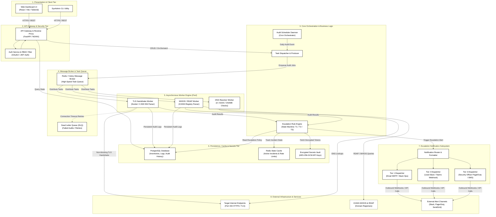
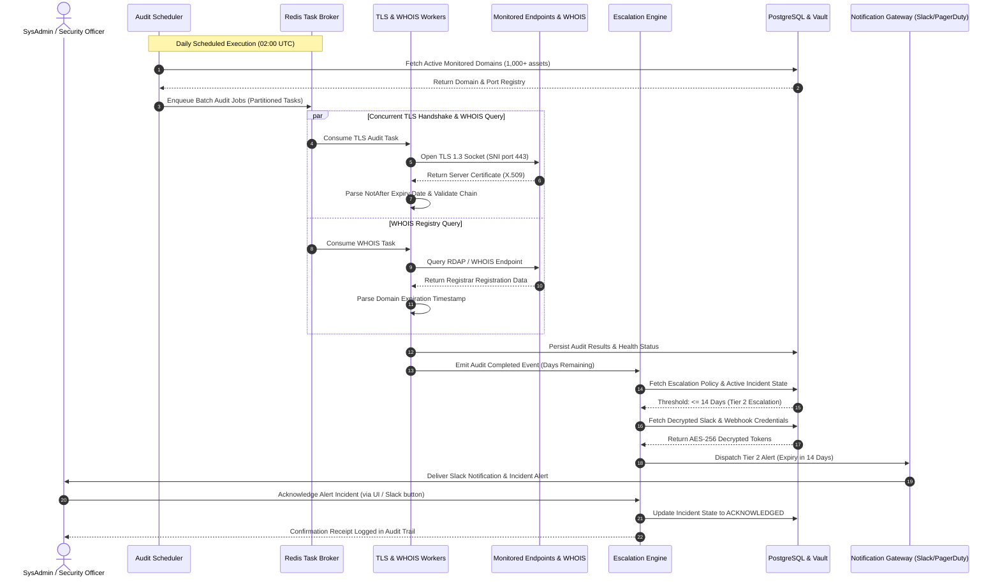

# Architectural Design Specification
## Domain & SSL Certificate Expiry Alert System
**Problem Statement #47 | Developer Tools & IT Operations**  

---

## 1. System Architecture Overview

The **Domain & SSL Certificate Expiry Alert System** is engineered using an **Asynchronous Event-Driven Micro-Service & Worker Pool Architecture**. The system operates across distributed, decoupled layers designed to satisfy high-throughput audit demands (scanning 1,000+ domains in under 3 minutes per NFR-001) while enforcing zero-trust security and multi-tier alerting resilience (NFR-002).

By decoupling the web presentation and API gateway from the heavy network I/O execution engine using an asynchronous message broker, the architecture eliminates blocking bottlenecks, guarantees horizontal scalability, and maintains sub-second responsiveness for SysAdmins and Security Officers.

---

## 2. High-Level Architectural Diagram

The system comprises five core architectural tiers:
1. **Presentation & API Gateway Tier:** Interactive responsive dashboard and secure RESTful endpoints.
2. **Core Orchestration & Scheduling Tier:** Central scheduler, pipeline controller, and rule-based escalation state machine.
3. **Asynchronous Distributed Worker Engine:** Non-blocking concurrent worker pool performing TLS handshakes, WHOIS/RDAP queries, and DNS verification.
4. **Multi-Tier Notification & Escalation Subsystem:** Multi-channel notification gateway dispatching alerts across escalation tiers.
5. **Persistence, State & Secrets Tier:** PostgreSQL relational database, Redis task queue & caching layer, and AES-256 encrypted credential store.

> **Note:** The editable Draw.io architecture diagram is provided in this folder: [`system_architecture.drawio`](./system_architecture.drawio) (can be opened and edited directly in [Draw.io / diagrams.net](https://app.diagrams.net)).

---

## 3. Subsystem Breakdown & Component Specifications

### 3.1 Presentation & API Gateway Tier
- **Web Dashboard UI:** Responsive Single Page Application (SPA) providing real-time data visualization of domain health, expiration countdown timers, root CA issuer breakdowns, cipher suite strengths, and active incident trackers.
- **API Gateway (FastAPI / NGINX):** Serves as the single ingress point. Manages rate limiting, request validation, TLS 1.3 termination, CORS policies, and routing.
- **RBAC Authentication Module:** Enforces Role-Based Access Control using JWT tokens and OAuth2 flows. Distinguishes between **SysAdmin** (operational CRUD, manual scan trigger) and **Security Officer** (compliance policy review, escalation management).

### 3.2 Core Orchestration & Business Logic
- **Audit Scheduler Daemon:** Cron-based master timer (e.g., Celery Beat / APScheduler) that executes scheduled audits across all active domains at configured intervals (default: daily at 02:00 UTC).
- **Task Dispatcher:** Converts active domain inventory records into lightweight asynchronous job payloads and pushes them into the Redis task broker with partitioned batch keys.
- **Escalation Rule Engine:** Implements a state machine evaluating `Remaining_Days` against tiered thresholds:
  - **Tier 1 (Warning):** Remaining validity <= 30 days. Dispatched to primary SysAdmin.
  - **Tier 2 (High):** Remaining validity <= 14 days or Tier-1 unacknowledged for > 48 hours. Escalated to SysAdmin Lead.
  - **Tier 3 (Critical Emergency):** Remaining validity <= 3 days or Tier-2 unacknowledged for > 24 hours. Escalated to Security Officer via high-priority on-call channels.

### 3.3 Asynchronous Distributed Worker Engine
- **TLS Handshake Worker:** Executes non-blocking TCP sockets with SNI (`Server Name Indication`), extracts X.509 certificates, computes cryptographic thumbprints, validates root CA chain integrity, and measures TLS negotiation latency.
- **WHOIS / RDAP Worker:** Executes HTTP REST queries against IANA/ICANN RDAP bootstrap servers with fallback to standard port 43 WHOIS. Parses registry expiration, registrar names, and domain lock statuses. Employs token-bucket rate limiting with exponential backoff to handle registrar rate limits gracefully.
- **DNS Resolver Worker:** Validates DNS records (A, AAAA, CNAME) to detect DNS hijacking, dangling CNAME takeovers, or domain resolution failures before TLS audits run.

### 3.4 Multi-Tier Notification & Escalation Subsystem
- **Notification Router:** Formats alert messages into target-specific templates:
  - Rich Markdown Slack messages with interactive "Acknowledge" buttons.
  - Standard MIME multipart HTML/Text emails via SMTP.
  - Structured JSON payloads for PagerDuty Incidents and custom corporate Webhooks.
- **Retry & Circuit Breaker Logic:** If an external notification endpoint fails (e.g., Slack rate limit HTTP 429), messages are routed to a Dead Letter Queue (DLQ) with jittered retries to guarantee delivery.

### 3.5 Persistence, State & Secrets Tier
- **PostgreSQL Relational DB:** Stores domain assets, TLS audit history, WHOIS registry metadata, user credentials, RBAC roles, and immutable compliance audit logs.
- **Redis In-Memory Store:** Serves as the message broker for Celery worker queues, caches active alert incident states, and manages distributed locks to prevent duplicate concurrent audits.
- **AES-256 Vault / Secrets Store:** Protects external webhook secrets, PagerDuty integration keys, and SMTP credentials using AES-256-GCM envelope encryption at rest (NFR-002).

---

## 4. End-to-End Data Flow Architecture

The following sequence illustrates the complete data lifecycle: from scheduled trigger to distributed execution, database logging, escalation evaluation, and multi-tier alert dispatch.

> **Note:** The editable Draw.io sequence and data flow diagram is provided in this folder: [`data_flow_architecture.drawio`](./data_flow_architecture.drawio) (can be opened and edited directly in [Draw.io / diagrams.net](https://app.diagrams.net)).

---

## 5. Architectural Design Patterns & Principles

| Pattern Name | Location in System | Architectural Purpose & Benefit |
| :--- | :--- | :--- |
| **Producer-Consumer Pattern** | Scheduler -> Redis -> Worker Pool | Decouples job generation from execution. Enables scaling workers horizontally to scan 1,000+ endpoints in < 3 minutes without overloading the host. |
| **Strategy Pattern** | Notification Gateway (`ChannelStrategy`) | Encapsulates alert channel logic (Slack, Email, PagerDuty, Webhook) behind a uniform interface, allowing new notification providers to be added with zero changes to core business logic. |
| **State Pattern** | Escalation Rule Engine (`IncidentState`) | Models the lifecycle of an alert across discrete states (`NORMAL` -> `WARNING_T1` -> `HIGH_T2` -> `CRITICAL_T3` -> `ACKNOWLEDGED` -> `RESOLVED`). |
| **Circuit Breaker & DLQ** | External Worker & Notification Handlers | Prevents cascade failures when remote WHOIS or Slack APIs experience outages. Unprocessable tasks divert to Dead Letter Queue for inspected replay. |
| **Repository Pattern** | Persistence Layer (PostgreSQL) | Decouples domain inventory and audit entity models from underlying database queries and ORM mappings. |

---

## 6. Non-Functional Architecture Alignment

### 6.1 Performance & Scalability (NFR-001)
- **Asynchronous Non-Blocking I/O:** Uses Python `asyncio` / gevent / greenlet socket pools to handle up to 250 concurrent socket handshakes per worker process.
- **Batch Processing:** 1,000 domains are divided into batches of 50 tasks across 4 worker processes. Each TLS handshake completes in ~50-150ms, yielding total scan completion within **45 to 75 seconds** (well within the <= 180 second / 3-minute limit).
- **Resource Constraints:** Workers are memory-capped at 512 MB per container (total <= 2 GB), utilizing epoll-driven event loops to keep CPU load below 50%.

### 6.2 Security, Resilience & High Availability (NFR-002)
- **Zero Plaintext Secrets:** All webhook URLs, Slack tokens, and database credentials are encrypted at rest using AES-256-GCM. Decryption keys are injected via environment variables or HashiCorp Vault.
- **Role-Based Access Control (RBAC):** API endpoints validate JWT claims. Modifying escalation thresholds requires `ROLE_SYSADMIN`, while compliance audits require `ROLE_SECURITY_OFFICER`.
- **High Availability (99.95% Uptime):** The monitoring scheduler runs in an active-standby configuration using Redis distributed leader election (`Redlock`). If the active scheduler node fails, the standby assumes the leader lock within 5 seconds.
